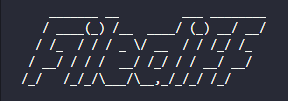

<p align="center">
  <a href="#" rel="noopener">
 </a>
</p>

<h3 align="center">@hexemeister/filediff</h3>

<div align="center">

[]()
[](https://github.com/hexemeister/filediff-cli/issues)
[](https://github.com/hexemeister/filediff-cli/pulls)
[](/LICENSE)

</div>

---

<p align="center"> A cli tool to export different rows in text files.
    <br> 
</p>

## 📝 Table of Contents

- [About](#about)
- [Getting Started](#getting_started)
- [Deployment](#deployment)
- [Usage](#usage)
- [Built Using](#built_using)
- [TODO](../TODO.md)
- [Contributing](https://github.com/hexemeister/filediff-cli/graphs/contributors)
- [Authors](#authors)
- [Acknowledgments](#acknowledgement)

## 🧐 About <a name = "about"></a>

At first, this project is just a javascript study. 

But it has come from a true necessity: to compare 2 files and export what differs between them.

## 🏁 Getting Started <a name = "getting_started"></a>

These instructions will get you a copy of the project up and running on your local machine for development and testing purposes.

### Prerequisites

Node.js only. If you don't have it installed, check at its webpage to download it first.

### Installing

Having Node.js installed, just install the package globally.

```
npm i -g @hexemeister/filediff
```

And wait a bit. When npm stops grumbling you're ready.

```
filediff -v
```

This will output the tool version.

Note that for one time run you can just use npx.

```
npx @hexemeister/filediff file1.txt file2.txt
```

## 🎈 Usage <a name="usage"></a>

Basic usage is:
```
filediff file1 file2
```
This will compare file1 with file2 and export the difference between these two to *filediff.txt*. Mind that the tool has a default command called *export*. Since it's the default command, you can omit as above example.
```
filediff export file1 file2
```
This will do the exactly the same as the first example. You can skip export command with no problem.

Note that order matters here. Actually, the command checks what file1 has and file2 doesn't. You can swap both filenames just adding a -i option instead of rewriting the command switching both filenames.
```
filediff -i file1 file2
```
The command above is the same as if you had written filediff file2 file1.
Another thing to notice is that the default result filename is *filediff.txt*. You can specify a custom result filename by adding -t <target-filename>.
```
filediff file1 file2 -t result.txt
```
This will have you a result.txt at the end of the comparison.

For more information, check its help:

```
filediff -h
```
## ⛏️ Built Using <a name = "built_using"></a>

- [NodeJs](https://nodejs.org/en/) - Server Environment
- [CommanderJS](https://github.com/tj/commander.js/) - Cli Framework
- [Figlet](https://github.com/patorjk/figlet.js) - Figfont

## ✍️ Authors <a name = "authors"></a>

- [@hexemeister](https://github.com/hexemeister) - Idea & Initial work

See also the list of [contributors](https://github.com/hexemeister/filediff-cli/graphs/contributors) who participated in this project.

## 🎉 Acknowledgements <a name = "acknowledgement"></a>

- Hat tip to anyone whose code was used
- Inspiration
- References
